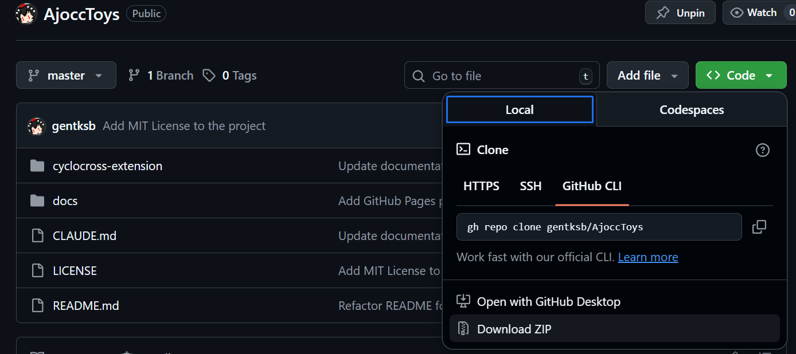

# AjoccToys

[AJOCC 公式ページ](https://www.cyclocross.jp/)の機能を拡張する**非公式**Chrome 拡張機能です。

現在、最初の機能としてリザルトページにラップタイムテーブルに表示される **経過時間** を、**ネットラップタイム（スプリットタイム）** に自動変換し、グラフ表示などの分析機能を提供します。

今後、選手として抱いていたニーズや機能要望に対応して、機能を追加していきます。

## 主な機能

### ⏱ ラップタイム変換機能

経過時間を自動的にネットラップタイムに変換します。

#### 変換例

**変換前（経過時間）:**
| 選手 | 1 周 | 2 周 | 3 周 | 4 周 |
|------|------|--------|--------|--------|
| Rider A | 9:28.1 | 19:22.6 | 29:20.6 | 40:00.2 |
| Rider B | 9:28.3 | 19:32.9 | 30:10.0 | 40:50.2 |

**変換後（ネットラップタイム）:**
| 選手 | 1 周 | 2 周 | 3 周 | 4 周 |
|------|------|------|------|-------|
| Rider A | 9:28.1 | 9:54.5 | 9:58.0 | 10:39.6 |
| Rider B | 9:28.3 | 10:04.6 | 10:37.1 | 10:40.2 |

- 変換されたセルは緑色の背景で表示
- 右上に ⏱ アイコン
- ホバーで元の経過時間を確認可能

#### ON/OFF 切り替え

ツールバーアイコンをクリックすることで、変換機能の ON/OFF を切り替えられます。

- 設定はブラウザに保存され、次回アクセス時も維持
- ページ上部に現在の状態を通知

#### ベストラップのハイライト

各選手の最速ラップとレース全体の最速ラップを自動的にハイライト表示します。

- **個人ベストラップ**: 黄色で表示、★ アイコン
- **レース全体ベストラップ**: オレンジ色で表示、🏆 アイコン
- スタートループの検出と除外

#### ラップタイムグラフ表示機能

ラップタイムの推移を視覚的に確認できるグラフ機能を搭載。

- **選手選択**: 名前の左側のチェックボックスで表示する選手を選択
- **1 周目有無選択**: スタートループの影響を除外した比較が可能
- **クイック選択**: 上位 3 名、全選手、すべて解除ボタン

## インストール方法

### 開発者モードでインストール（推奨）

1. このリポジトリをクローンまたは Code ボタンから ZIP ダウンロードします
   

   ```bash
   git clone https://github.com/gentksb/ajocc-tools.git
   cd ajocc-tools
   ```

2. Google Chrome を開き、アドレスバーに `chrome://extensions/` と入力して Enter キーを押します

3. 右上の「デベロッパーモード」を ON にします

4. 「パッケージ化されていない拡張機能を読み込む」をクリックします

5. ZIP を解凍したフォルダから `cyclocross-extension` フォルダを選択します

6. 拡張機能が読み込まれ、アイコンが表示されます。初回利用のためにピン留めを推奨します

### Chrome Web Store からのインストール

Chrome Web Store の登録厳格化により、現在ストア公開予定はありません。

## 使用方法

### 基本的な使い方

1. 拡張機能をインストール後、シクロクロス公式リザルトページにアクセスします

   - 例: https://data.cyclocross.jp/race/24830

2. ページが読み込まれると、自動的にラップタイムが変換されます

3. 変換を無効にしたい場合は、ツールバーのアイコンをクリックして OFF にします（拡張機能をピン留めすると便利です）

### グラフ機能の使い方

1. **選手を選択**: テーブル内の選手名の左側にあるチェックボックスをクリック

   - チェックを入れると自動的にグラフが表示されます

2. **クイック選択を利用**:

   - 「上位 3 名」: 1 位〜3 位の選手を一括選択
   - 「全選手」: すべての選手を一括選択
   - 「すべて解除」: すべての選択を解除

3. **1 周目の表示切替**:

   - 「1 周目を表示」チェックボックスで 1 周目を含めるか選択
   - スタートループが短い大会では、OFF にすることで純粋な周回タイムを比較できます

4. **グラフへ移動**:
   - テーブル上部の「⬇️ グラフに移動」ボタンで素早くグラフまでスクロール
   - テーブル下部の「📊 グラフを表示/非表示」ボタンでグラフの表示を切り替え

## 対応する時間フォーマット

- `SS.d` （例: 45.2）- 1 分未満のラップ
- `MM:SS` （例: 9:28）
- `MM:SS.d` （例: 9:28.1）- 実際のページで使用
- `MM:SS.dd` （例: 9:28.12）
- `MM:SS.ddd` （例: 9:28.123）
- `HH:MM:SS` （例: 1:09:28）
- `HH:MM:SS.d` （例: 1:09:28.1）
- `HH:MM:SS.dd` （例: 1:09:28.12）
- `HH:MM:SS.ddd` （例: 1:09:28.123）

※ 小数点以下は 1 桁（1/10 秒）、2 桁（1/100 秒）、3 桁（1/1000 秒）に対応

## 機能詳細

### 自動検出機能

拡張機能は以下の処理を自動で行います:

1. ページ内の `table__laptime` クラスを持つテーブルを検出
2. ヘッダー行の `cell__lapat` クラスを持つ列（「1 周」「2 周」など）を特定
3. 各選手の経過時間を読み取り、ネットラップタイムを計算
4. スタートループを検出して、ベストラップ判定から除外
5. 変換されたセルに視覚的なマーカーを表示

**特徴:**

- 元の経過時間は `data-original-time` 属性に保存され、ホバー時に表示
- DNS（欠場）や未完走の選手は自動的にスキップ
- ページ構造の変更にも柔軟に対応

## トラブルシューティング

### 拡張機能が動作しない場合

1. **ページをリロード**: Ctrl+R (Windows/Linux) または Cmd+R (Mac) でページを再読み込みしてください

2. **拡張機能の再読み込み**:

   - `chrome://extensions/` を開く
   - 本拡張機能の「再読み込み」ボタンをクリック

3. **コンソールログを確認**:
   - F12 キーを押して開発者ツールを開く
   - Console タブを選択
   - 「Cyclocross Lap Time Converter」で始まるログメッセージを確認

### ラップタイムが変換されない場合

以下の原因が考えられます:

1. **ページ構造が想定と異なる**:

   - ページの HTML が更新された可能性があります
   - Issue を作成して報告してください

2. **時間フォーマットが未対応**:

   - 対応していない時間フォーマットの可能性があります
   - Issue で具体例を報告してください

3. **テーブル構造の検出に失敗**:
   - ラップタイム列を自動検出できなかった可能性があります
   - ページの URL とともに Issue を作成してください

### グラフが表示されない場合

1. **選手を選択**: チェックボックスをクリックして選手を選択してください
2. **ブラウザの互換性**: Chrome/Edge の最新版を使用してください
3. **コンソールエラーを確認**: F12 または Ctl+I で開発者ツールを開き、エラーがないか確認してください

## 今後の予定

### 検討中の機能

- **CSV エクスポート機能**: 変換後のラップタイムを CSV でダウンロード
- **より高度なラップ比較機能**: 複数選手の差分を詳細に分析

詳細は [開発者向けドキュメント（CLAUDE.md）](./CLAUDE.md) をご覧ください。

## バージョン履歴

- **v1.3.3**: manifest.json の情報更新
- **v1.3.2**: チェックボックスとライダー名の表示修正
- **v1.3.1**: グラフ UI 改善（クイック選択、上部ボタン）
- **v1.3.0**: グラフ表示機能実装
- **v1.2.6**: 1 周目の扱い改善
- **v1.2.0**: ベストラップのハイライト機能
- **v1.1.0**: ON/OFF 切り替え機能
- **v1.0.0**: 基本的なラップタイム変換機能

## ライセンス

MIT License

## 貢献

バグ報告、機能要望、プルリクエストを歓迎します！

## 作者

[gentksb](https://github.com/gentksb)

## リンク

- [GitHub Repository](https://github.com/gentksb/AjoccToys)
- [Issues](https://github.com/gentksb/AjoccToys/issues)
- [Pull Requests](https://github.com/gentksb/AjoccToys/pulls)
